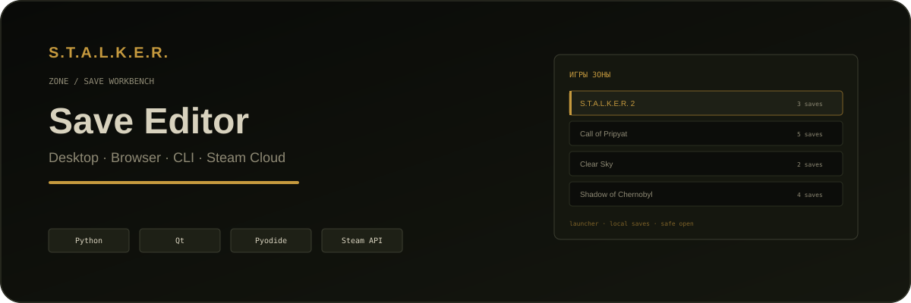
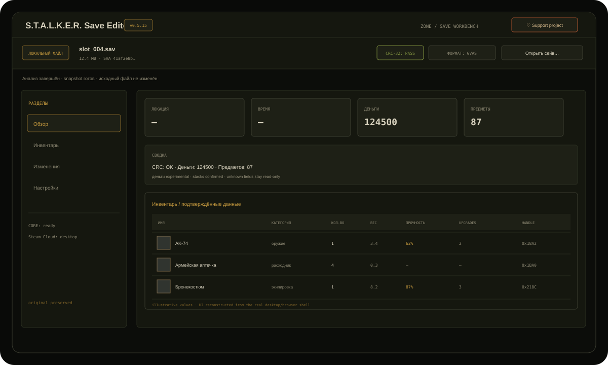

<p align="center">
  
</p>

<p align="center">
  <a href="https://github.com/Dmitriy-DE/S.T.A.L.K.E.R.-Save_Editor/releases/latest"></a>
  
  
  
  
</p>

<p align="center">
  <a href="https://stalker-save-editor.pages.dev"><b>Open in browser</b></a>
  ·
  <a href="https://github.com/Dmitriy-DE/S.T.A.L.K.E.R.-Save_Editor/releases/latest"><b>Download desktop</b></a>
  ·
  <a href="https://github.com/Dmitriy-DE/S.T.A.L.K.E.R.-Save_Editor/issues"><b>Report an issue</b></a>
</p>

# S.T.A.L.K.E.R. Save Editor

A cross-platform save editor for the official PC releases of **S.T.A.L.K.E.R. 2** and the original **Shadow of Chernobyl / Clear Sky / Call of Pripyat** trilogy.

The project uses **one Python editing core** across the Qt desktop app, CLI and browser build. Local files are analysed offline; unsupported structures stay read-only instead of being guessed.

> **Safety first:** edits are staged and verified before export. Local editing writes a new copy rather than silently replacing the original save. Steam Cloud writes are explicit and guarded by backup/hash verification.

The current release line is `0.5.16`. A release is published only from a clean
tagged commit after the Linux and Windows packaged gates pass.

<p align="center">
  
</p>

<p align="center"><sub>Illustrative values; the layout and controls are reconstructed from the actual desktop/browser UI.</sub></p>

## What it does

- discovers local saves for supported official PC releases;
- detects the game/release from file contents instead of trusting the filename;
- reads money, inventory and technical container metadata;
- edits only capabilities proven for the detected format;
- stages changes before writing;
- verifies CRC / Kraken framing / parser round-trip where applicable;
- exports a new local copy;
- provides a Qt desktop app, CLI and browser build over the same core;
- supports S.T.A.L.K.E.R. 2 Steam Cloud from the desktop app;
- packages standalone Windows and Linux builds — **Python is not required for end users**.

## Game support

| Game | Status | Editing surface |
|---|---|---|
| **S.T.A.L.K.E.R. 2: Heart of Chornobyl** | Supported | money, confirmed stack edits, save-local inventory names; experimental condition editing for confirmed equipped armour; desktop Steam Cloud |
| **Shadow of Chernobyl — Original** | Supported | X-Ray inventory, money, confirmed stacks, catalogue-backed item operations and confirmed equipment fields |
| **Clear Sky — Original** | Supported | X-Ray inventory, money, confirmed stacks, catalogue-backed item operations; experimental equipment/upgrades where the exact format anchor is proven |
| **Call of Pripyat — Original** | Supported | X-Ray inventory, money, confirmed stacks, catalogue-backed item operations; helmet/equipment/upgrades where the exact format anchor is proven |
| **Enhanced Editions** | Not yet supported | release/path profiles exist, but parsing and editing stay disabled until format evidence is available |
| **Mods / unknown save formats** | Out of scope | fail closed |

### S.T.A.L.K.E.R. 2 boundaries

The project intentionally does **not** pretend that every visible catalogue entry can already be reconstructed inside a save.

Still read-only / research-gated in S2:

- arbitrary item creation from SID;
- general weapon condition editing;
- weapon/equipment upgrade mutation without a proven serializer path;
- unknown GVAS inventory structures;
- unsupported Enhanced Edition containers.

## Download

The latest release ships four end-user packages.

| Platform | Package |
|---|---|
| Windows | [Installer (.exe)](https://github.com/Dmitriy-DE/S.T.A.L.K.E.R.-Save_Editor/releases/latest/download/SaveEditor-windows-x86_64-setup.exe) |
| Windows | [Portable (.zip)](https://github.com/Dmitriy-DE/S.T.A.L.K.E.R.-Save_Editor/releases/latest/download/SaveEditor-windows-x86_64.zip) |
| Linux / Debian / Ubuntu | [.deb package](https://github.com/Dmitriy-DE/S.T.A.L.K.E.R.-Save_Editor/releases/latest/download/stalker2-save-editor_amd64.deb) |
| Linux | [Portable (.tar.gz)](https://github.com/Dmitriy-DE/S.T.A.L.K.E.R.-Save_Editor/releases/latest/download/SaveEditor-linux-x86_64.tar.gz) |
| Browser | [stalker-save-editor.pages.dev](https://stalker-save-editor.pages.dev) |

Checksums are published with each GitHub release.

## Desktop workflow

```text
Zone library
    ↓
choose / import save
    ↓
content-based format detection
    ↓
inspect inventory + metadata
    ↓
stage supported edits
    ↓
preview + verify
    ↓
export new copy
```

The desktop app exposes a release-aware Steam Cloud flow for S.T.A.L.K.E.R. 2,
the original trilogy and separate Enhanced Edition profiles. Each profile carries
its Steam app ID and remote save root into native, helper, cache and CDP paths;
the UI reports which backend answered. Native calls use bounded subprocesses so a
stuck Steam call cannot freeze the Qt UI indefinitely. Upload remains explicit,
backup/hash guarded and reports verified versus uncertain outcomes.

## Updates and standalone packages

Each GitHub release publishes separate Windows installer and portable ZIP files,
Linux portable `tar.gz`, Debian `.deb`, `latest.json` and `SHA256SUMS`:

- the installer creates the normal Windows installation and shortcut;
- portable Windows and Linux bundles require neither Python nor installation;
- desktop checks `latest.json` in the background and has a manual update action;
- portable updates verify size and SHA-256, then replace files only after the
  application exits; installer and `.deb` updates require explicit confirmation.

The manifest and binaries are also mirrored to the public Cloudflare R2 download
worker. Invalid manifests, unexpected hosts, network failures or hash mismatches
leave the current installation untouched.

## Browser build

The browser version runs the same Python core through **Pyodide/WebAssembly**.

- the save stays in the browser tab;
- there is no application backend receiving the file;
- supported local edits can be downloaded as a new copy;
- Steam Cloud is desktop-only.

Run it locally:

```bash
make web-serve
# http://localhost:8765
```

## Architecture

```text
                    ┌──────────────────────┐
                    │   shared Python core │
                    │ parser / editor /    │
                    │ preview / verify     │
                    └──────────┬───────────┘
                               │
             ┌─────────────────┼─────────────────┐
             │                 │                 │
             ▼                 ▼                 ▼
      Qt desktop app          CLI        Browser / Pyodide
             │                                   │
             ▼                                   ▼
      Steam Cloud / local                    local files
```

Important boundaries:

- **UI does not own save mutation logic** — it goes through the shared editor service.
- **Unknown fields remain opaque/read-only.**
- **Content detection wins over path assumptions.**
- **Round-trip correctness is not treated as proof of in-game semantic acceptance.**
- **Live Steam writes and game load/re-save checks are kept separate from automated CI.**

## Run from source

Requires Python 3.11+.

```bash
git clone https://github.com/Dmitriy-DE/S.T.A.L.K.E.R.-Save_Editor.git
cd S.T.A.L.K.E.R.-Save_Editor

python3 -m pip install -r requirements.txt
python3 -m ui
```

Windows:

```powershell
py -3 -m pip install -r requirements.txt
py -3 -m ui
```

CLI:

```bash
python3 cli.py --help
```

The CLI supports the same bounded edit surface where the selected format is
confirmed: money, stacks, durability, upgrades and placement. Unsupported S2
equipment structures and Enhanced Edition bytes fail closed instead of being
written through a guessed serializer.

Developer checks:

```bash
python3 -m pip install -r requirements-dev.txt
make check
```

CI covers source tests plus packaged diagnostics for Linux and Windows. Release builds also produce the Windows installer, portable archives, Debian package, manifest and SHA-256 checksums.

## Project status

The current stable release is shown in the badge above. Release history and binaries are available on the [Releases](https://github.com/Dmitriy-DE/S.T.A.L.K.E.R.-Save_Editor/releases) page.

The detailed engineering/evidence log remains in [docs/STATUS.md](docs/STATUS.md). Format research and validation evidence live under [docs/evidence/](docs/evidence/).

The public Issues board is for **bugs, user-facing features and roadmap items**. Internal research notes and implementation cards belong in the repository documentation, not as dozens of open user-facing tickets.

## Roadmap

- [S.T.A.L.K.E.R. 2: expand equipment editing beyond confirmed armour anchors](https://github.com/Dmitriy-DE/S.T.A.L.K.E.R.-Save_Editor/issues/95)
- [Enhanced Editions: add safe format detection and parser support](https://github.com/Dmitriy-DE/S.T.A.L.K.E.R.-Save_Editor/issues/96)
- [Validate experimental X-Ray equipment mutations in game](https://github.com/Dmitriy-DE/S.T.A.L.K.E.R.-Save_Editor/issues/97)
- [Steam Cloud: broaden support and improve runtime diagnostics](https://github.com/Dmitriy-DE/S.T.A.L.K.E.R.-Save_Editor/issues/98)
- [UX: simplify save flow without weakening backup and verification](https://github.com/Dmitriy-DE/S.T.A.L.K.E.R.-Save_Editor/issues/99)
## Contributing

Bug reports and focused feature requests are welcome.

Before opening a bug, include:

- game + edition;
- editor version;
- desktop / browser / CLI;
- OS;
- what you expected;
- what happened;
- whether the original save still loads.

Do **not** attach personal save files publicly unless you are comfortable publishing their contents. A minimal synthetic/reproducible sample is preferred.

## License

GNU GPL v3. See [LICENSE](LICENSE).

S.T.A.L.K.E.R. and related names/assets belong to their respective owners. This project is an independent community tool and is not affiliated with GSC Game World.
