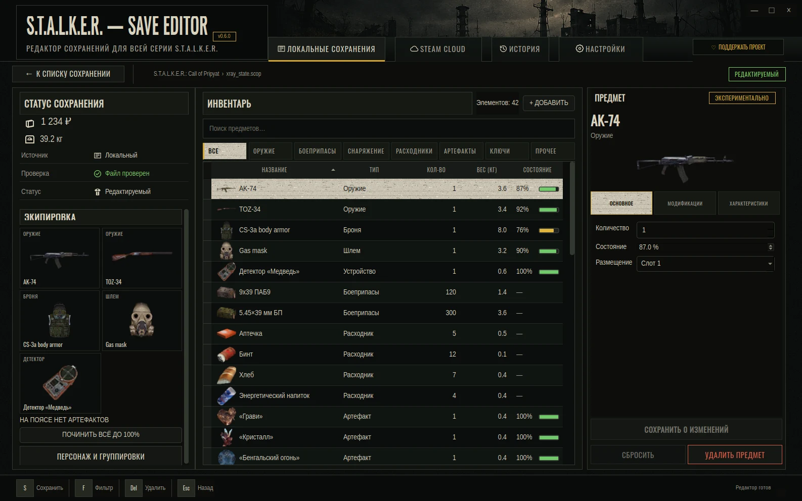
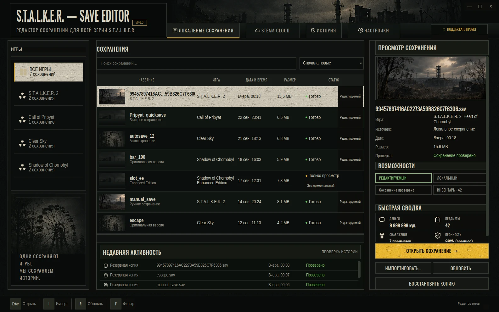

<p align="center">
  
</p>

<p align="center">
  <a href="https://github.com/Dmitriy-DE/S.T.A.L.K.E.R.-Save_Editor/releases/latest"></a>
  <a href="https://github.com/Dmitriy-DE/S.T.A.L.K.E.R.-Save_Editor/actions/workflows/test.yml"></a>
  
  
  
  
</p>

<p align="center">
  <a href="https://github.com/Dmitriy-DE/S.T.A.L.K.E.R.-Save_Editor/releases/latest"><b>Download desktop</b></a>
  ·
  <a href="https://stalker-save-editor.pages.dev"><b>Open in browser</b></a>
  ·
  <a href="https://github.com/Dmitriy-DE/S.T.A.L.K.E.R.-Save_Editor/issues"><b>Report an issue</b></a>
</p>

# S.T.A.L.K.E.R. Save Editor

A save editor for the official PC releases of **S.T.A.L.K.E.R. 2: Heart of
Chornobyl** and the original **Shadow of Chornobyl / Clear Sky / Call of
Pripyat** trilogy — as a desktop app for Windows and Linux, a CLI, and a
browser build that never uploads your save.

It reads the save, shows your money, inventory and loadout, lets you change
what the format is proven to support, and writes the result only after a
verified backup. Anything the editor cannot decode with certainty stays
read-only instead of being guessed.

<p align="center">
  
</p>
<p align="center">
  
</p>
<p align="center"><sub>Real desktop UI rendered from the repository's synthetic review fixtures.</sub></p>

## Highlights

- **One library for the whole series.** Finds local saves for all four games
  (Steam / Proton paths included), detects the game from the file contents,
  not the file name, and shows date, size and status at a glance.
- **Real loadout view.** Weapons, armour, helmet and detector the save marks
  as equipped, plus the artifacts on your belt.
- **Edit what is proven.** Money, stack counts, catalogue item add/remove,
  weapon/armour condition, placement, X-Ray upgrades and faction relations —
  each gated per game and per save, experimental writes clearly marked.
- **Safe by construction.** Changes are staged as a draft; one «Сохранить»
  click re-checks the source hash, writes a verified backup, replaces the
  file atomically and reads it back. History restores any backup.
- **Steam Cloud for S.T.A.L.K.E.R. 2.** Download a cloud slot, edit it and
  upload it back with an explicit confirmation; an uncertain Steam write is
  reconciled, never retried blindly.
- **No Python required** for the Windows installer/portable build, the Linux
  portable build or the Debian package.

## Game support

| Game | Editable | Experimental* |
|---|---|---|
| **S.T.A.L.K.E.R. 2: Heart of Chornobyl** | money | weapon and armour condition where the exact owned-row anchor is present; Steam Cloud round-trip |
| **Call of Pripyat** | money, stacks, catalogue item add/remove | condition, placement, upgrades, faction relations, player faction |
| **Clear Sky** | money, stacks, catalogue item add/remove | condition, placement, upgrades, faction relations, player faction |
| **Shadow of Chornobyl** | money, stacks, catalogue item add/remove | condition, placement, faction relations, player faction |
| **Enhanced Editions** | — detected and shown read-only until format evidence exists | |
| **Mods / unknown formats** | — refused (fail closed) | |

<sub>* Written and verified by parser round-trip; in-game acceptance is still
being confirmed ([#97](https://github.com/Dmitriy-DE/S.T.A.L.K.E.R.-Save_Editor/issues/97)).
S.T.A.L.K.E.R. 2 stacks, modules, devices and upgrades are shown read-only.</sub>

Item names and icons come from the installed game or a bundled metadata
snapshot. For S.T.A.L.K.E.R. 2, point **Settings → Paths** at a Zone Kit or
Workshop resource folder to get localized names and icons; without it the
editor shows the save's own item IDs. Round-trip verification proves the file
is well-formed, not that the game accepts every change — keep the backup until
you have loaded the save in game.

## Download

| Platform | Package |
|---|---|
| Windows | [Installer (.exe)](https://github.com/Dmitriy-DE/S.T.A.L.K.E.R.-Save_Editor/releases/latest/download/SaveEditor-windows-x86_64-setup.exe) · [Portable (.zip)](https://github.com/Dmitriy-DE/S.T.A.L.K.E.R.-Save_Editor/releases/latest/download/SaveEditor-windows-x86_64.zip) |
| Debian / Ubuntu | [.deb package](https://github.com/Dmitriy-DE/S.T.A.L.K.E.R.-Save_Editor/releases/latest/download/stalker2-save-editor_amd64.deb) |
| Linux | [Portable (.tar.gz)](https://github.com/Dmitriy-DE/S.T.A.L.K.E.R.-Save_Editor/releases/latest/download/SaveEditor-linux-x86_64.tar.gz) |
| Browser | [stalker-save-editor.pages.dev](https://stalker-save-editor.pages.dev) — the save stays in your browser tab |

Every release ships `SHA256SUMS` and an update manifest (`latest.json`). The
desktop app checks for updates in the background (автообновление):
Windows portable and Linux portable builds verify size and SHA-256 and swap
files only after the app exits; the installer and the `.deb` hand the verified
package to the system installer. Binaries are mirrored to a Cloudflare R2
download Worker.

## How a save is written

```text
open save ─► detect game from content ─► parse inventory & metadata
    │
    ▼
stage edits (draft only, file untouched)
    │
    ▼  «Сохранить» + one confirmation
re-check source SHA ─► verified backup ─► atomic replace ─► read-back + re-parse
```

Steam Cloud uploads keep the original `Data/<slot>.sav` locator, back up the
remote bytes first and report *verified* versus *uncertain* results. The app
never deletes cloud files.

## Run from source

Requires Python 3.11+.

```bash
git clone https://github.com/Dmitriy-DE/S.T.A.L.K.E.R.-Save_Editor.git
cd S.T.A.L.K.E.R.-Save_Editor
python3 -m pip install -r requirements.txt
python3 -m ui              # desktop app
python3 cli.py --help      # command line
make web-serve             # browser build on http://localhost:8765
```

## Architecture

```text
                 ┌──────────────────────────────┐
                 │   shared Python editing core │
                 │ detect · parse · prepare ·   │
                 │ verify · backup · publish    │
                 └──────────────┬───────────────┘
            ┌───────────────────┼───────────────────┐
            ▼                   ▼                   ▼
    Qt desktop (PySide6)       CLI          Browser (Pyodide)
            │
            ▼
   local saves · Steam Cloud
```

- The UI never owns mutation logic; every surface goes through the same
  editor service and capability gates.
- Unknown fields stay opaque; content detection wins over paths.
- Live game and Steam writes are kept out of automated CI.

## Development

```bash
python3 -m pip install -r requirements-dev.txt
make check      # ruff, mypy, generated web/theme checks
make test       # full pytest suite (runs against a throwaway user profile)
```

Maintainers prepare a release from CI-built packages with
`make release-manifest`; see [CONTRIBUTING.md](CONTRIBUTING.md) and
[docs/RELEASE.md](docs/RELEASE.md). The engineering log lives in
[docs/STATUS.md](docs/STATUS.md) and format evidence in
[docs/evidence/](docs/evidence/).

## Roadmap

- [S.T.A.L.K.E.R. 2: expand equipment editing beyond confirmed armour anchors](https://github.com/Dmitriy-DE/S.T.A.L.K.E.R.-Save_Editor/issues/95)
- [Enhanced Editions: safe format detection and parser support](https://github.com/Dmitriy-DE/S.T.A.L.K.E.R.-Save_Editor/issues/96)
- [Validate experimental X-Ray equipment mutations in game](https://github.com/Dmitriy-DE/S.T.A.L.K.E.R.-Save_Editor/issues/97)
- [Steam Cloud: broader support and runtime diagnostics](https://github.com/Dmitriy-DE/S.T.A.L.K.E.R.-Save_Editor/issues/98)

## Contributing

Bug reports and focused feature requests are welcome. Please include the game
and edition, editor version, desktop/browser/CLI, OS, what you expected, what
happened, and whether the original save still loads. Do not attach personal
saves publicly unless you are comfortable publishing their contents.

## License

GNU GPL v3 — see [LICENSE](LICENSE).

S.T.A.L.K.E.R. and related names and assets belong to their respective owners.
This is an independent community tool, not affiliated with GSC Game World.
